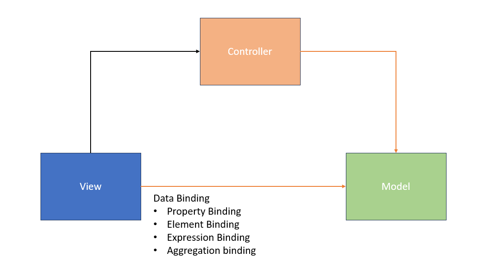
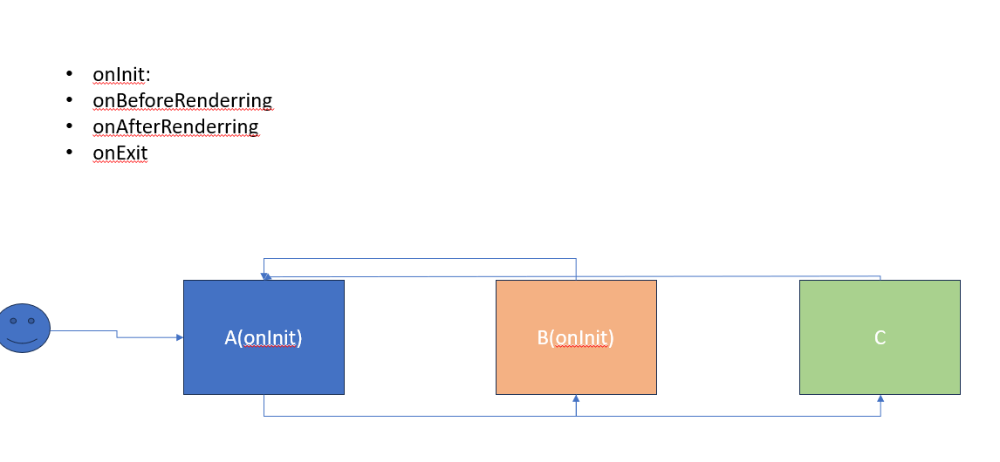

## Application Details
- getProperty
- setProperty

-attachEvent
-detachEvent
-fireEvent

### Models

- OData Model
- Json Model
- XML Model
- Resource Model

To Access a Named Model: `ModelName>Property Path`
To Access a Default Model: `Property Path`
And To Generate a Property Path: Replace "{" With "/"